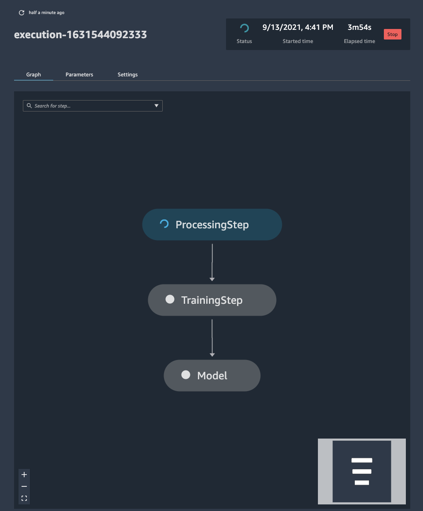

# Process Amazon RedShift data and schedule a training pipeline with Amazon SageMaker Processing and Amazon SageMaker Pipelines

In this repository, we use [Amazon SageMaker](https://aws.amazon.com/sagemaker/) Processing API to run a query against a RedShift cluster, create CSV files, and perform distributed processing. As an extra step, we also train a simple model to predict the total sales for new events, and build a pipeline with Amazon SageMaker Pipelines to be able to schedule it.

Start with the [`redshift-sagemaker-pipeline.ipynb`](redshift-sagemaker-pipeline.ipynb) notebook. It contains the instructions to build step-by-step a SageMaker Pipeline that pulls data from Amazon Redshift, processes it with SageMaker Processing, then trains a SKLearn model.

## Prerequisites

This blog post uses the sample data that is available when creating a Free Tier cluster in [Amazon RedShift](https://aws.amazon.com/redshift/free-trial/). Here, we take into account that your RedShift cluster has already been created and that you have attached to it an IAM role with the correct permissions. To learn how to do both these operations, check the two following links:

* Create the cluster with the sample dataset - [Link](https://docs.aws.amazon.com/redshift/latest/gsg/sample-data-load.html)
* Associate the role to the cluster - [Link](https://docs.aws.amazon.com/redshift/latest/mgmt/data-api.html#data-api-access)

After this has been created, you can use your IDE of choice to open the notebooks. This content has been developed and tested using [SageMaker Studio](https://aws.amazon.com/sagemaker/studio/), on a `ml.t3.medium` instance. If you want to know more about SageMaker Studio, you can learn here:

* What is Amazon SageMaker Studio - [Link](https://aws.amazon.com/sagemaker/studio/)
* How to set-up you Amazon SageMaker Studio domain - [Link](https://docs.aws.amazon.com/sagemaker/latest/dg/gs-studio-onboard.html)
* Cloning a repository in Amazon SageMaker Studio - [Link](https://docs.aws.amazon.com/sagemaker/latest/dg/studio-tasks-git.html)
* Changing instance type on a Amazon SageMaker Notebook - [Link](https://docs.aws.amazon.com/sagemaker/latest/dg/notebooks-run-and-manage-switch-instance-type.html)

